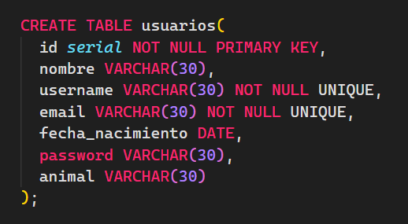

# Final Drilling M5 Java Trainee

Un sistema de hóróscopo Chino

## Instrucciones para poblar datos

Dentro de la carpeta de data/ se encuentra la secuencia de comandos `data.sql`, para ejectuar este archivo se debe cambiar la ruta absoluta por la propia del equipo donde se ejecute el proyecto

### Campos del modelo de datos para Usuarios

### Usando

- Posgresql
- Java 17 (Ojala...)
- Apache Tomcat 10.1

### Paquetes

- dao: Implementa las interfaces para el crud
- interfaces: Regla las clases para ser implementadas por el DAO
- modelo: Las entidades que tienen contacto directo con la base de datos
- procesaconexion: La conexion con la base de datos
- servlets: Gestionan las peticiones Http
- filters: Las clases para restringir el acceso a ciertas vistas dependiendo del estado del usuario
- util: Clases utilitarias generales

### Flujo de accion
  1. Crear la logica de lectura del horoscopo (Listo)

  2. Crear la logica de usuario después para asegurar que podré contar con los datos del horóscopo en tiempo real para la asignación durante el proceso de registro

      2.1. Hacer que el registro funcione (LISTO)
 
      2.2. Hacer que el login funcione (LISTO)
 
      2.3. Hacer que el filter funcione
 
      2.4. Hacer que listar (Buscar funcione)
 
      2.5. Hacer que editar y eliminar funcionen
 